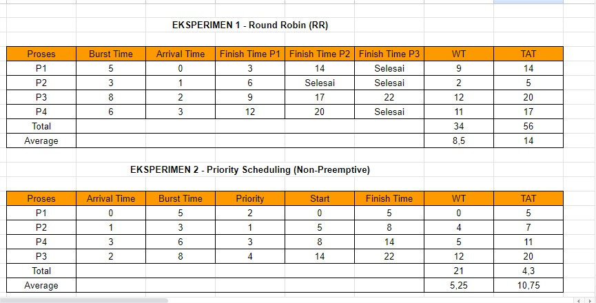

# Laporan Praktikum Minggu  6
Topik: Penjadwalan CPU – Round Robin (RR) dan Priority Scheduling

---

## Identitas
- **Nama**  : Putri Amaliya Rahmadani 
- **NIM**   : 250202924
- **Kelas** : 1 IKRA

---

## Deskripsi Singkat
Pada praktikum minggu ini, mahasiswa akan mempelajari **dua algoritma lanjutan penjadwalan CPU**, yaitu:
- **Round Robin (RR)**  
- **Priority Scheduling**

Kedua algoritma ini banyak digunakan pada sistem modern karena mempertimbangkan **keadilan waktu eksekusi (time quantum)** dan **tingkat prioritas proses**.  
Mahasiswa akan melakukan simulasi perhitungan manual untuk menghitung *waiting time* dan *turnaround time*, serta menganalisis efek perbedaan *time quantum* dan prioritas terhadap performa CPU scheduling.

---


## Tujuan
Setelah menyelesaikan tugas ini, mahasiswa mampu:
1. Menghitung waiting time dan turnaround time pada algoritma RR dan Priority.
2. Menyusun tabel hasil perhitungan dengan benar dan sistematis.
3. Membandingkan performa algoritma RR dan Priority.
4. Menjelaskan pengaruh time quantum dan prioritas terhadap keadilan eksekusi proses.
5. Menarik kesimpulan mengenai efisiensi dan keadilan kedua algoritma.


---

## Dasar Teori
1. Round Robin (RR) adalah metode penjadwalan CPU yang setiap prosesnya dijalankan secara bergiliran atau sesuai dengan waktu yang telah ditentukan, sehingga pada setiap proses akan mendapatkan urutan yang adil.
2. Time Quantum adalah waktru maksimum yang diberikan CPU untuk menjalankan satu proses didalam metode Round Robin.Jika proses terlalu kecil, maka sistem akan responsif tetapi banyak proses yang pindah, jika proses terlalu besar, maka proses yang lain akan menunggu lebih lama lagi tetapi CPU akan lebih efisien.
3. Turnaround Time adalah waktu total yang dibutuhkan proses pada saat masuk ke sistem sampai selesai atau finish.Turnaround time dapat dihitung melalui mengurangi waktu kedatangan dari waktu selesai proses.
4. Waiting Time adalah total waktu yang dihabiskan proses untuk menunggu giliran CPU, pada proses waiting time waktu menunggu diperoleh dari selisih antara turnaround time dengan burst time.
5. Priority Scheduling adalah metode penjadwalan CPU yang prosesnya dijalankan melalui prioritas, sehingga dapat menyebabkan proses yang prioritas tinggi dijalankan terlebih dahulu.Namun, proses dengan prioritas rendah dapat mengalami starvation, dan metode ini dapat bersifat preemptive ataupun non-preemptive.

---
## Langkah Praktikum
1. Langkah-langkah yang dilakukan.
2. Perintah yang dijalankan.
3. File dan kode yang dibuat.
4. Commit message yang digunakan.

---


## Kode / Perintah
1. **Siapkan Data Proses** Gunakan contoh data berikut (boleh dimodifikasi sesuai kebutuhan):

| Proses |	Burst Time |	Arrival Time |	Priority |
|:--:|:--:|:--:|:--:|
| P1 |	5 |	0 |	2 |
| P2 |	3 |	1 |	1 |
| P3 |	8 |	2 |	4 |
| P4 |	6 |	3 |	3 |
2. **Eksperimen 1 – Round Robin (RR)**

- Gunakan time quantum (q) = 3.
- Hitung waiting time dan turnaround time untuk tiap proses.
- Simulasikan eksekusi menggunakan Gantt Chart (manual atau spreadsheet).

```
| P1 | P2 | P3 | P4 | P1 | P3 | ...
0    3    6    9   12   15   18  ...
```

- Catat sisa burst time tiap putaran.
3. **Eksperimen 2 – Priority Scheduling (Non-Preemptive)**

- Urutkan proses berdasarkan nilai prioritas (angka kecil = prioritas tinggi).
- Lakukan perhitungan manual untuk:
```
WT[i] = waktu mulai eksekusi - Arrival[i]
TAT[i] = WT[i] + Burst[i]
```
- Buat tabel perbandingan hasil RR dan Priority.
4. **Eksperimen 3 – Analisis Variasi Time Quantum (Opsional)**

- Ubah quantum menjadi 2 dan 5.
- Amati perubahan nilai rata-rata waiting time dan turnaround time.
- Buat tabel perbandingan efek quantum.
5. **Eksperimen 4 – Dokumentasi**

- Simpan semua hasil tabel dan screenshot ke:

``praktikum/week6-scheduling-rr-priority/screenshots/``

- Buat tabel perbandingan seperti berikut:

| Algoritma |	Avg Waiting Time |	Avg Turnaround Time	| Kelebihan |	Kekurangan |
|-----------|------------------|----------------------|-----------|------------|
| RR |	... |	... | Adil terhadap semua proses |	Tidak efisien jika quantum tidak tepat |
| Priority |	... |	... |	Efisien untuk proses penting |	Potensi starvation pada prioritas rendah |


---

## Hasil Eksekusi
Sertakan screenshot hasil percobaan atau diagram:


1. Eksperimen 1 - Round Robin (RR), Quantum = 3
   - Simulasi Gntt Chart
     - Putaran 1
       - P1: 0-3 (sisa 2)
       - P2: 3-6 (sisa 0 - selesai)
       - P3: 6-9 (sisa 5)
       - P4: 9-12 (sisa 3)
      - Putaran 2
        - P1: 12-14 (sisa 0 - selesai)
        - P3: 14-17 (sisa 2)
        - P4: 17-20 (sisa 0 - selesai)
      - Putaran 3
        - P3: 20-22 (selesai)
     - Gantt Chart Final

       ```bash
       P1 | P2 | P3 | P4 | P1 | P3 | P4 | P3
       0   3    6    9   12   14   17   20   22
       ```

     - Hitung Finish Time

| Proses | Finish | Arrival | Burst | TAT = Finish - Arrival | WT = TAT - Burst |
| :----: | :----: | :-----: | :---: | :--------------------: | :--------------: |
|   P1   |   14   |    0    |   5   |           14           |         9        |
|   P2   |    6   |    1    |   3   |            5           |         2        |
|   P3   |   22   |    2    |   8   |           20           |        12        |
|   P4   |   20   |    3    |   6   |           17           |        11        |

 
Total dan Rata-Rata
   - WT total = 9+2+12+11=34
   - WT rata-rata= 34/4=8,5
   - TAT total= 14+5+20+17=56
   - TAT rata-rata= 56/4=14
2. Eksperimen 2 - Priority Scheduling (Non-Preemptive)
- Hitung waktu mulai dan finish
  
| Proses | Arr | Burst | Pri | Start | Finish |
| :----: | :-: | :---: | :-: | :---: | :----: |
|   P2   |  1  |   3   |  1  |   1   |    4   |
|   P1   |  0  |   5   |  2  |   4   |    9   |
|   P4   |  3  |   6   |  3  |   9   |   15   |
|   P3   |  2  |   8   |  4  |   15  |   23   |

- Hitung WT dan TAT

 | Proses | WT = Start - Arr | TAT = WT + Burst |
| :----: | :--------------: | :--------------: |
|   P2   |         0        |         3        |
|   P1   |         4        |         9        |
|   P4   |         6        |        12        |
|   P3   |        13        |        21        | 

Total rata-rata:
- WT total= 23 - WT rata-rata= 5,75
- TAT total= 45 - TAT rata-rata= 11,25


3. Eksperimen 3 - Variasi Time Quantum
   - Quantum=2
     - Avg WT= 10,25
     - Avg TAT= 15,75

    - Quantum=5
      - Avg WT= 7
      - Avg TAT= 12,5

    - Tabel Perbandingan

| Algoritma                     | Avg WT | Avg TAT | Kelebihan                  | Kekurangan                       |
| ----------------------------- | ------ | ------- | -------------------------- | -------------------------------- |
| **RR (q=3)**                  | 8.5    | 14      | Adil, time-sharing         | Tidak efisien bila quantum salah |
| **Priority (Non-Preemptive)** | 5.75   | 11.25   | Cepat untuk proses penting | Starvation                       |
| **RR (q=2)**                  | 10.25  | 15.75   | Lebih responsif            | Overhead tinggi                  |
| **RR (q=5)**                  | 7      | 12.5    | Lebih efisien              | Kurang responsif                 |

---

## Analisis
1. Round Robin (Quantum = 3)
Hasil perhitungan menunjukkan bahwa setiap proses mendapatkan giliran eksekusi secara bergantian. Proses dengan burst time panjang membutuhkan beberapa putaran sebelum selesai sehingga waktu tunggu rata-rata menjadi lebih besar.
Nilai:
WT rata-rata = 8.5
TAT rata-rata = 14
Dari hasil ini tampak bahwa metode ini memberikan pembagian waktu yang merata kepada semua proses. Setiap proses pasti mendapat kesempatan, tetapi waktu tunggu menjadi lebih lama karena harus menunggu putaran berikutnya. Metode ini sangat dipengaruhi ukuran quantum: semakin kecil quantum, semakin sering proses dipotong sehingga menyebabkan penambahan waktu tunggu.
2. Priority Scheduling (Non-Preemptive)
Pada metode ini, proses dengan nilai prioritas paling tinggi mendapatkan giliran terlebih dahulu. Hasil perhitungan menunjukkan bahwa proses penting dapat selesai lebih cepat karena langsung dieksekusi tanpa menunggu proses lain yang prioritasnya lebih rendah.
Nilai:
WT rata-rata = 5.75
TAT rata-rata = 11.25
Hasil ini menampilkan keunggulan metode prioritas dalam mempercepat penyelesaian proses dengan kepentingan tinggi. Namun, proses dengan prioritas rendah dapat mengalami waktu tunggu yang sangat lama, seperti yang terjadi pada P3 yang menunggu hingga proses lain selesai. Kondisi seperti ini dapat menyebabkan proses tertentu tidak segera diproses.
3. Pengaruh Variasi Quantum
Quantum = 2
WT rata-rata = 10.25
TAT rata-rata = 15.75
Quantum yang kecil membuat CPU sering melakukan pergantian proses. Keadaan ini menambah total waktu eksekusi karena setiap proses hanya berjalan sebentar sebelum dihentikan.
Quantum = 5
WT rata-rata = 7
TAT rata-rata = 12.5
Quantum yang lebih besar membuat proses dapat berjalan lebih lama sebelum digantikan. Kondisi ini mengurangi jumlah perpindahan proses dan memberikan hasil waktu tunggu yang lebih rendah.
Dari perbandingan kedua nilai quantum tersebut, terlihat bahwa pemilihan quantum yang tepat sangat mempengaruhi performa penjadwalan. Quantum terlalu kecil membuat sistem kurang efisien, sementara quantum yang lebih besar memberikan penyelesaian yang lebih cepat, namun perlu disesuaikan agar tidak mengorbankan sifat time-sharing.
4. Ringkasan Keseluruhan
Round Robin memberikan pembagian waktu yang merata untuk semua proses, cocok untuk sistem interaktif, tetapi waktu tunggu bisa menjadi besar.
Priority Scheduling memberikan penyelesaian cepat untuk proses yang penting, namun proses kurang penting bisa menunggu sangat lama.
Variasi quantum menunjukkan bahwa ukuran quantum adalah faktor yang sangat menentukan.
Quantum kecil → sistem lebih sibuk melakukan pergantian proses.
Quantum besar → proses lebih cepat selesai tetapi kurang responsif.
Setiap metode memiliki kelebihannya masing-masing dan penggunaannya disesuaikan dengan kebutuhan sistem.

---

## Kesimpulan
- Round Robin akan menjamin pada setiap proses mendapatkan giliran CPU secara adil dan urut, sedangkan Priority Scheduling akan lebih menekankan eksekusi proses berdasarkan prioritas.
- Time Quantum memengaruhi performa pada sistem, jika quantum kecil yang membuat sistem responsif tetapi banyak context switching, sedangkan pada quantum besar akan lebih efisien yang membuat respons lain jadi lambat.
- Turnaround Time dan Waiting Time  menjadi indikator penting yang digunakan untuk menilai efisiensi dan fairness penjadwalan CPU.
  
---

## Tugas
1. Hitung waiting time dan turnaround time untuk algoritma RR dan Priority.

1.) Round Robin (RR) Quantum = 3
- Finish time tiap proses:
  - P1 selesai pada t = 14
  - P2 selesai pada t = 6
  - P3 selesai pada t = 22
  - P4 selesai pada t = 20

   
| Proses |	Burst Time |	Arrival Time |	Finish Time P1 |	Finish Time P2 |	Finish Time P3 |	WT | TAT |
|--------|-------------|---------------|-----------------|-----------------|-----------------|-----|-----|
| P1 | 5 | 0 |	3 |	14 |	Selesai |	9 |	14 |
| P2 |	3 |	1 |	6 |	Selesai | Selesai |	2 |	5 |
| P3 |	8 |	2 |	9 |	17 |	22 |	12 |	20 |
| P4 |	6 |	3 |	12 |	20 |	Selesai |	11 |	17 |
| Total |  |  |  |  |  | 34 | 56 |	
| Average |  |  |  |  |  | 8,5 | 14 |	

- Total / Rata-rata:
  Total WT = 9 + 2 + 12 + 11 = 34 → WT rata-rata = 34 / 4 = 8.5
  Total TAT = 14 + 5 + 20 + 17 = 56 → TAT rata-rata = 56 / 4 = 14

2.) Priority Scheduling (non-preemptive)

- Mulai / Finish:
  - P2 mulai t = 1, finish = 1 + 3 = 4
  - P1 mulai t = 4, finish = 4 + 5 = 9
  - P4 mulai t = 9, finish = 9 + 6 = 15
  - P3 mulai t = 15, finish = 15 + 8 = 23
  - Hitung

| Proses |	Arrival Time |	Burst Time |	Priority |	Start |	Finish Time |	WT |	TAT |
|--------|---------------|-------------|-----------|----------------|-----|----|----|
| P1 |	0 |	5 |	2 |	0 |	5 |	0 |	5 |
| P2 |	1 |	3 |	1 |	5 |	8 |	4 |	7 |
| P4 |	3 |	6 |	3 |	8 | 14 |	5 |	11 |
| P3 |	2 |	8 |	4 |	14 |	22 |	12 |	 20 |
| Total	|  |  |  |  |  | 21 | 4,3 |
| Average |   |   |   |   |   | 5,25 | 10,75 |

- Total / Rata-rata:
  - Total WT = 0 + 4 + 6 + 13 = 23 → WT rata-rata = 23 / 4 = 5.75
  - Total TAT = 3 + 9 + 12 + 21 = 45 → TAT rata-rata = 45 / 4 = 11.25

- Ringkasan singkat hasil:
  - RR (q=3): WT rata-rata = 8.5, TAT rata-rata = 14
  - Priority (non-preemptive): WT rata-rata = 5.75, TAT rata-rata = 11.25

  
2. Sajikan hasil perhitungan dan Gantt Chart dalam laporan.md.
-  Tabel – Round Robin (RR) Quantum = 3
   
| Proses |	Burst Time |	Arrival Time |	Finish Time P1 |	Finish Time P2 |	Finish Time P3 |	WT | TAT |
|--------|-------------|---------------|-----------------|-----------------|-----------------|-----|-----|
| P1 | 5 | 0 |	3 |	14 |	Selesai |	9 |	14 |
| P2 |	3 |	1 |	6 |	Selesai | Selesai |	2 |	5 |
| P3 |	8 |	2 |	9 |	17 |	22 |	12 |	20 |
| P4 |	6 |	3 |	12 |	20 |	Selesai |	11 |	17 |
| Total |  |  |  |  |  | 34 | 56 |	
| Average |  |  |  |  |  | 8,5 | 14 |	

Gantt Chart RR – q=3
```bash
P1 | P2 | P3 | P4 | P1 | P3 | P4 | P3
0   3   6   9   12  14  20  22  26
```
- Tabel – Priority (Non-Preemptive)

| Proses |	Arrival Time |	Burst Time |	Priority |	Start |	Finish Time |	WT |	TAT |
|--------|---------------|-------------|-----------|----------------|-----|----|----|
| P1 |	0 |	5 |	2 |	0 |	5 |	0 |	5 |
| P2 |	1 |	3 |	1 |	5 |	8 |	4 |	7 |
| P4 |	3 |	6 |	3 |	8 | 14 |	5 |	11 |
| P3 |	2 |	8 |	4 |	14 |	22 |	12 |	 20 |
| Total	|  |  |  |  |  | 21 | 4,3 |
| Average |   |   |   |   |   | 5,25 | 10,75 |

Gantt Chart Priority

```bash
P1 | P2 | P4 | P3
0   5   8   14  22
```

3. Bandingkan performa dan jelaskan pengaruh time quantum serta prioritas.

Perbandingan performa: 
- Round Robin (q = 3) — Average Turnaround = 14, Average Waiting = 8,5
- Priority (non-preemptive) — Average Turnaround = 10,75, Average Waiting = 5,25
- RR (q = 2) — Average Turnaround = 15,75, Average Waiting = 10,25
- RR (q = 5) — Average Turnaround = 12,5, Average Waiting = 7

Penjelasan makna dari angka tersebut : 
- Priority (non-preemptive) memberikan performa terbaik dalam contoh ini (nilai TAT dan WT terendah). Hal ini karena proses berprioritas tinggi dieksekusi lebih awal tanpa preemption sehingga mengurangi waktu tunggu beberapa proses penting.
- RR dengan quantum kecil (q=2) menghasilkan more context switches dan fairness tinggi tapi menyebabkan waiting time dan turnaround meningkat di skenario ini.
- RR dengan quantum besar (q=5) mendekati perilaku FCFS sehingga WT/TAT menurun dibanding q kecil — tetapi fairness untuk job pendek bisa berkurang.
- RR q=3 berada di tengah — memberikan kompromi antara responsivitas dan overhead.

Pengaruh time-quantum (prinsip umum):
- Quantum kecil → lebih sering preempt → overhead context-switch ↑ → WT & TAT cenderung ↑ (terutama untuk CPU-bound panjang). Cocok untuk sistem interaktif (respons cepat untuk proses pendek).
- Quantum besar → preempt jarang → sistem mendekati FCFS → overhead ↓, WT/TAT untuk job panjang ↓, tetapi proses pendek bisa menunggu lebih lama.
- Praktik: pilih quantum yang seukuran dengan rata-rata burst time proses interaktif agar trade-off responsivitas vs overhead seimbang.

 Pengaruh prioritas (prinsip umum):
- Prioritas tinggi → dijalankan lebih cepat → TAT & WT proses penting turun.
- Risiko starvation bagi prioritas rendah bila tidak ada mekanisme mitigasi. Solusi umum: aging (menaikkan prioritas seiring waktu).
- Preemptive priority meningkatkan responsivitas untuk proses berprioritas tinggi tetapi menambah preemption overhead.

Rekomendasi praktis (berdasarkan hasil):
- Jika sistem menuntut responsivitas untuk job pendek / interaktif, gunakan RR dengan quantum kecil–sedang (tapi monitor overhead).
- Jika ada proses yang sangat penting (latency-sensitive), gunakan scheduling berbasis prioritas — tambahkan aging untuk menghindari starvation.
- Untuk beban campuran, pertimbangkan hybrid (mis. multilevel feedback queue) agar bisa menggabungkan fairness RR dan preferensi prioritas.


## Quiz
1. Apa perbedaan utama antara Round Robin dan Priority Scheduling?
   Perbedaan yang utama dari segi penjadwalan (scheduling) antara lain:
   - Round Robin: penjadwalan (scheduling) yang berdasarkan urutan dengan time quantum, tanpa melihat penting atau tidaknya proses.
   - Priority Scheduling: penjadwalan yang berdasarkan prioritas, atau proses dengan prioritas tertinggi yang didahulukan dari proses lain.
2. Apa pengaruh besar/kecilnya time quantum terhadap performa sistem?
 - Time *Quantum Kecil*
   - Kelebihan :
     - Pada sistem akan terasa lebih cepat saat merespon karena proses sering mendapatkan urutan atau giliran.
     - Proses bagus untuk progam yang masih memerlukan reaksi segera.
   - Kekurangan :
     - Pergantian pada proses sangan sering yang menyebabkan waktu CPU banyak yang terbuang.
     - Kinerja pada sistem sering menurun karena terlalu banyak overhead.
 - Time *Quantum Besar*
   - Kelebihan :
     - Context switching lebih sedikit yang menyebabkan proses CPU lebih optimal.
     - Proses yang panjang dapat berjalan lebih lancar dan cepat.
   - Kekurangan :
      - Kurangnya responsif pada sistem yang dijalankan.
      - Dapat menunggu proses yang lain menunggu lebih lama.
 - Kesimpulan:
      - Time quantum harus dipilih secara seimbang, kalau terlalu dapat membuat sistem menjadi responsif tetapi lebih boros pada performa, sementara jika terlalu besar dapat membuat sistem efisien tetapi lebih lambat dalam merespon.Quantum lebih ideal memberikan keseimbangan pada respons cepat dan efisien CPU.
        
3. Mengapa algoritma Priority dapat menyebabkan starvation?
  - Algoritma Priority dapat menyebabkan starvation karena proses yang prioritasnya rendah akan terus menunggu jika selalu ada proses yang prioritas tinggi berdatangan.Alhasil, proses rendah bisak tidak pernah dijalankan ataupun prosesnya terlupakan sehingga tidak pernah selesai, inilah yang sering disebut starvation. 

---

## Refleksi Diri
Tuliskan secara singkat:
- Apa bagian yang paling menantang minggu ini?
  melakukan perhitungan untuk semua algoritma penjadwalan.  
- Bagaimana cara Anda mengatasinya?
  bertanya,dan mencoba terus.

---

**Credit:**  
_Template laporan praktikum Sistem Operasi (SO-202501) – Universitas Putra Bangsa_
